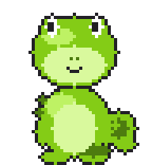
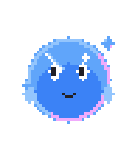
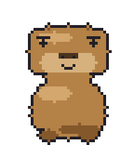

# Skales Pixel Pets

The Skales buddy family as [Petdex](https://petdex.dev)-format pixel pets:
one `spritesheet.png` (1536x1872 = 8 cols x 9 rows of 192x208 frames) plus a
`pet.json` per pet. Rows follow the canonical Petdex animation states:

| row | state | frames | loop |
|---|---|---|---|
| 0 | idle | 6 | 1100 ms |
| 1 | running-right | 8 | 1060 ms |
| 2 | running-left | 8 | 1060 ms |
| 3 | waving | 4 | 700 ms |
| 4 | jumping | 5 | 840 ms |
| 5 | failed | 8 | 1220 ms |
| 6 | waiting | 6 | 1010 ms |
| 7 | running | 6 | 820 ms |
| 8 | review | 6 | 1030 ms |

| | |
|---|---|
|  | **Skales** - the gecko |
|  | **Bubbles** - the water blob |
|  | **Capy** - the capybara |

All three are original Skales artwork, drawn procedurally (no image models).

## Use in Skales

These three ship built in: Settings > General > Desktop App > Buddy Skin >
Custom pixel skins. Any other pet from the petdex.dev gallery can be imported
there by URL or slug.

## Submit to the Petdex gallery

Each folder is a ready-to-submit Petdex package:

```sh
npx petdex submit ./pets/skales-pixel
npx petdex submit ./pets/bubbles-pixel
npx petdex submit ./pets/capy-pixel
```

(Requires a petdex.dev login; the CLI walks through it. Alternatively drop the
folder on https://petdex.dev/submit.)

These pets are original Skales artwork (c) Mario Simic, submitted under the
same spirit as the rest of the gallery. Petdex is a project by
[Crafter Station](https://crafter.run) - thanks for keeping the format and API
open.
